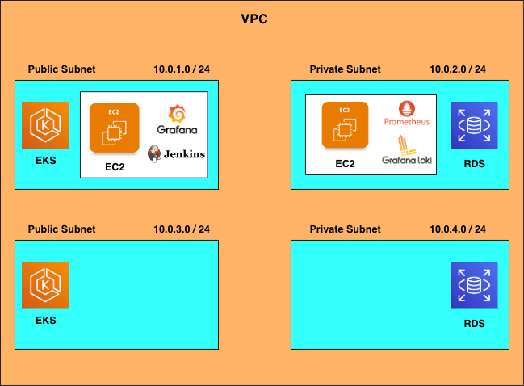
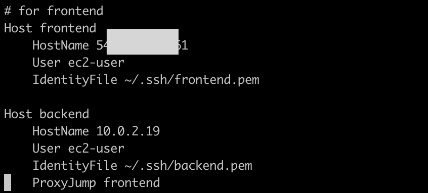

# AWS 微服務自動化部署專案 (EKS + RDS + Terraform)

本專案旨在透過 **Infrastructure as Code (IaC)** 與 **Ansible** 自動化配置工具，在 AWS 環境上構建高可用性的微服務基礎設施。

## 🚀 專案概述

* **專案源碼：** [GitHub Repository](https://github.com/king610160/ecommerce_microservice.git)
* **技術棧：** Terraform, Ansible, AWS EKS, AWS RDS, ArgoCD, Jenkins.
* **架構設計：** 
    * **網路規劃：** 建立自定義 VPC，劃分各兩個 Public 與 Private Subnet。
    * **安全隔離：** EKS Worker Nodes 與前端服務置於 Public Subnet；資料庫 (RDS) 與核心後端服務置於 Private Subnet。
* **系統架構圖：**
    

---

## 2. 部署流程

### 步驟一：建立基礎網路與監控環境 (VPC & EC2)
進入 `ec2_monitor` 目錄，初始化 VPC 與監控主機。
* **Public VM：** 開放 Port 22, 3000, 8080, 9100。
* **Private VM：** 開放 Port 22, 3100, 3200, 4317, 9090。

```bash
cd ec2_monitor
terraform init
terraform plan
terraform apply
```

---

### 步驟二：安裝運維服務 (Jenkins)

進入 `ansible` 資料夾進行部署。在執行之前，請確保您的環境已安裝必要套件，並正確配置 SSH 連線資訊，以利 Ansible 順利登入目標主機。

* **前置作業：** 請先設定 `inventory.ini` 或 `~/.ssh/config`。
* **SSH 配置參考圖：**
    

#### 執行指令：

```bash
# 切換至 ansible 目錄
cd ansible

# 安裝必要的 Python 依賴套件
pip install -r requirements.txt

# 執行 Ansible Playbook 安裝 Jenkins
ansible-playbook -i inventory.ini ./jenkins/install_jenkins.yml
```

---
### 步驟三：建立 EKS 集群與 RDS 資料庫

進入 `eks_rds` 目錄，部署核心的容器運算環境與關聯式資料庫。本步驟會透過 Terraform 自動化配置高可用性架構。

#### 建立內容：
* **EKS Cluster：** 建立 1 個控制平面與 3 個 Worker Nodes。
* **EC2 Spot Instances：** Worker Nodes 使用 Spot 執行個體，顯著降低測試環境成本。
* **基礎組件：** 自動安裝 VPC-CNI, CoreDNS, Kube-Proxy。
* **AWS ALB Controller：** 預先配置負載均衡控制器。
* **RDS Instance：** 建立資料庫實例並開放 Port 3306。

> **注意：** EKS 的資源準備較為複雜，預計建立時間約需 **10-15 分鐘**。

#### 執行指令：

```bash
# 切換至 eks_rds 目錄
cd eks_rds

# 初始化 Terraform
terraform init

# 確認執行計畫
terraform plan

# 執行部署
terraform apply
```


---

# AWS 微服務自動化部署指南 (EKS + RDS + Terraform)

本專案透過 Terraform 進行基礎設施管理 (IaC)，並結合 Ansible 自動化配置環境，構建基於 AWS EKS 與 RDS 的微服務架構。

---

## 1. 專案概述

* 專案源碼：[ecommerce_microservice](https://github.com/king610160/ecommerce_microservice.git)
* 系統架構圖：
* 架構設計說明：
    * Public Subnet：部署 EKS Cluster (Worker Nodes) 與前端服務。
    * Private Subnet：部署資料庫 (RDS) 與核心後端服務，確保安全性。

---

## 2. 部署流程

### 步驟一：建立基礎網路與監控環境 (VPC & EC2)
進入 ec2_monitor 目錄，初始化 VPC 與監控主機。
* Public VM：開放 Port 22, 3000, 8080, 9100。
* Private VM：開放 Port 22, 3100, 3200, 4317, 9090。

執行指令
```bash
cd ec2_monitor
terraform init
terraform plan
terraform apply
```
---

### 步驟二：安裝運維服務 (Jenkins)
進入 ansible 目錄部署 Jenkins。開始前請確保 inventory.ini 或 ~/.ssh/config 已正確設定。

* SSH 配置參考圖：

執行指令
```
cd ansible
pip install -r requirements.txt
ansible-playbook -i inventory.ini ./jenkins/install_jenkins.yml
```

* 註：其它資料夾就是在 vm 上部置監控的 Prometheus 家族，但用不太到，可視情況部署
---

### 步驟三：建立 EKS 集群與 RDS 資料庫
進入 eks_rds 目錄，建立容器環境與資料庫。
* EKS Cluster：包含 3 個 Worker Nodes (使用 Spot Instance)。
* RDS Instance：開放 Port 3306。
* Secret：當中有 DB 的連線資訊

執行指令
```bash
cd eks_rds
terraform init
terraform plan
terraform apply
aws eks update-kubeconfig --region [YOUR_REGION] --name [YOUR_CLUSTER_NAME]
```

* 註： secret.tf 會有關於 secret 的部建，其中有 RDS 的 secret，因此會先將 secret.tf 移出，等部署完後再填入對應的 secret，才能部署到 secret manager
---

### 步驟四：部署 K8s 基礎組件 (ArgoCD & Metrics Server)
使用 Ansible 在 EKS 上自動化安裝基礎組件。
* Argocd (In-cluster)
* Metrics-server

執行指令
```bash
cd ansible
ansible-playbook -i inventory.ini ./argocd_deploy/argocd_deploy.yml
```
---

### 步驟五：部署應用程式 (AP Services)
執行最後的 Playbook，透過 ArgoCD 完成微服務部署。

執行指令
```bash
cd ansible
ansible-playbook -i inventory.ini ./argocd_deploy/ap_deploy.yml
```
---

## 3. 注意事項
* 部署時間：EKS 建立約需 10-15 分鐘。
* 成本控管：實驗結束後請務必執行 terraform destroy 以免產生額外費用。